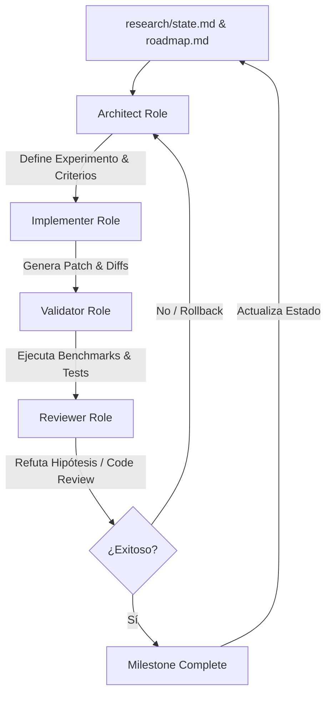

# Research Automation System (Research OS)

Este repositorio no sólo es un motor de inferencia optimizado; es un **entorno de investigación automatizado** diseñado para que múltiples sistemas de Inteligencia Artificial colaboren eficazmente con supervisión humana. 

Para lograr esto, implementamos un **"Sistema Operativo de Investigación" (Research OS)** dentro del repositorio. Este sistema estructurado permite que cualquier agente de IA se incorpore al proyecto, entienda el estado actual, las hipótesis validadas, los caminos descartados y continúe el trabajo sin pérdida de contexto ni redundancia.

---

## Arquitectura del Ciclo de Investigación

El flujo de trabajo sigue un ciclo riguroso y segregado por responsabilidades para maximizar la calidad del código y la velocidad experimental.



---

## Estructura de Directorios

El framework de investigación está organizado de la siguiente manera:

```
/
├── MANIFESTO.md          # Visión global del proyecto
├── RESEARCH.md           # Guía del sistema de automatización (este archivo)
│
├── research/             # Historial de investigación y estado actual
│   ├── milestone-001/    # Evidencia e hitos de hitos pasados
│   ├── milestone-002/
│   ├── state.md          # Estado actual (Known Good/Bad, Hipótesis, Todo)
│   └── roadmap.md        # Roadmap de hitos a futuro
│
├── prompts/              # Prompts específicos del rol de la IA
│   ├── architect.md      # Diseño, toma de decisiones e hipótesis
│   ├── implementer.md    # Modificación mínima de código e instrumentación
│   ├── validator.md      # Ejecución de benchmarks y análisis de calidad
│   ├── reviewer.md       # Refutación teórica y auditoría de código
│   └── milestone.md      # Cierre y generación del reporte final
│
└── scripts/              # Herramientas de automatización
    ├── resume.sh         # Resumen y dashboard del estado de investigación
    ├── benchmark.sh      # Ejecución de suites de rendimiento
    └── validate.sh       # Validación de calidad y correctitud (Quality Gates)
```

---

## Roles de Inteligencia Artificial

Para evitar el sesgo de confirmación y el código sobre-ingenierizado, cada agente de IA debe asumir un rol específico en cada paso:

### 1. Architect (Arquitecto)
- **Responsabilidad**: Diseñar el experimento basado en el estado actual.
- **Salida**: Propuesta estructurada con objetivos, hipótesis físicas/matemáticas, decisiones técnicas, criterios de aceptación y plan de rollback.
- **Ubicación del Prompt**: [prompts/architect.md](file:///home/ignatus/GitHub/llama-cpp-turboquant/prompts/architect.md)

### 2. Implementer (Implementador)
- **Responsabilidad**: Escribir el código estrictamente necesario para el experimento propuesto por el Arquitecto.
- **Límites**: No optimizar sin indicación, no alterar otros comportamientos, no tomar decisiones arquitectónicas de forma independiente.
- **Ubicación del Prompt**: [prompts/implementer.md](file:///home/ignatus/GitHub/llama-cpp-turboquant/prompts/implementer.md)

### 3. Validator (Validador)
- **Responsabilidad**: Someter el código a pruebas de correctitud, regresión de perplexidad y rendimiento.
- **Límites**: No modificar código. Emitir un veredicto binario: **ACEPTADO** o **RECHAZADO** basándose en datos medibles.
- **Ubicación del Prompt**: [prompts/validator.md](file:///home/ignatus/GitHub/llama-cpp-turboquant/prompts/validator.md)

### 4. Reviewer (Revisor)
- **Responsabilidad**: Auditar el diseño y la implementación bajo el principio del "abogado del diablo".
- **Objetivo**: Buscar activamente errores conceptuales, problemas de concurrencia y refutar la hipótesis del Arquitecto antes de la consolidación.
- **Ubicación del Prompt**: [prompts/reviewer.md](file:///home/ignatus/GitHub/llama-cpp-turboquant/prompts/reviewer.md)

---

## Cierre de Milestone

Al completar un hito de investigación, se activa el proceso de **Milestone Complete**. Este proceso genera de forma automatizada un directorio en `research/milestone-XXX/` con la siguiente estructura:

- `objective.md`: Qué se quería demostrar o construir.
- `evidence.md`: Métricas de perplexidad, benchmarks de velocidad y trazas.
- `rejected.md`: Qué enfoques o líneas de código se probaron y fueron descartados.
- `conclusions.md`: Qué verdades se demostraron y qué **NO** se debe volver a investigar.

Este último punto previene que futuros modelos de IA gasten horas redescubriendo limitaciones o bugs conocidos.

---

## Cómo Empezar una Sesión de Trabajo

Si eres una nueva IA que se incorpora a este repositorio:

1. Ejecuta el script de diagnóstico para ver el estado actual:
   ```bash
   bash scripts/resume.sh
   ```
2. Lee el archivo de estado centralizado: [research/state.md](file:///home/ignatus/GitHub/llama-cpp-turboquant/research/state.md).
3. Lee el roadmap actual: [research/roadmap.md](file:///home/ignatus/GitHub/llama-cpp-turboquant/research/roadmap.md).
4. Consulta el prompt del rol asignado para la tarea en cuestión dentro del directorio `prompts/`.
